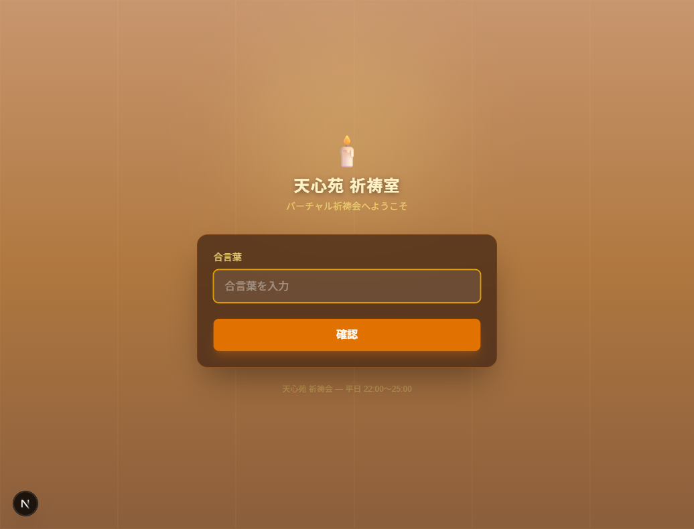
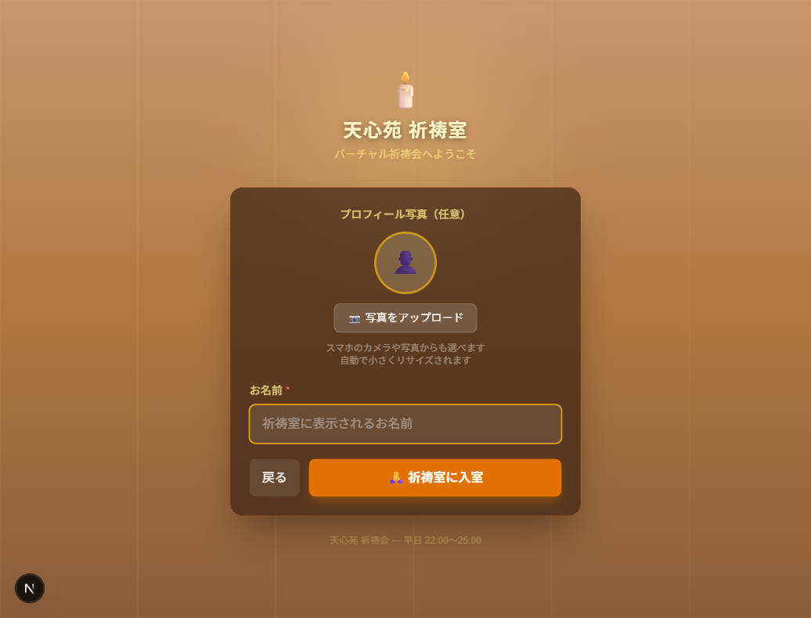
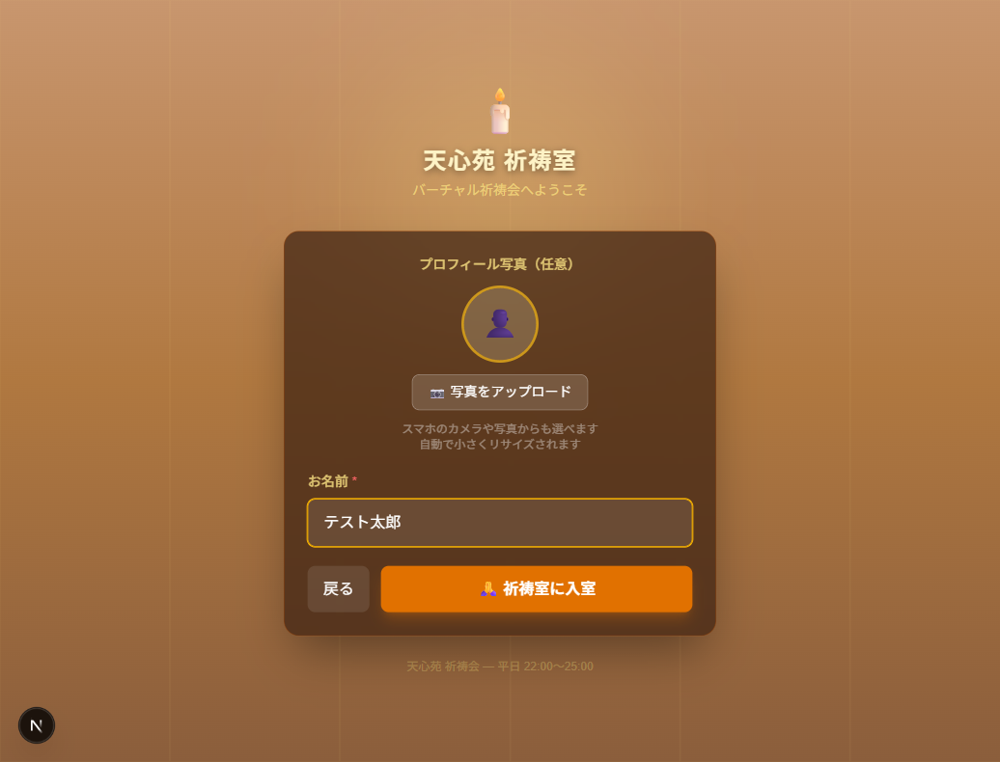
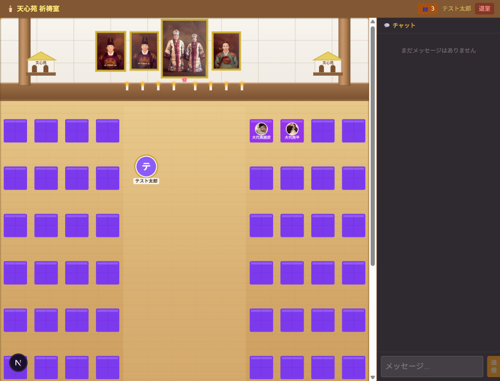
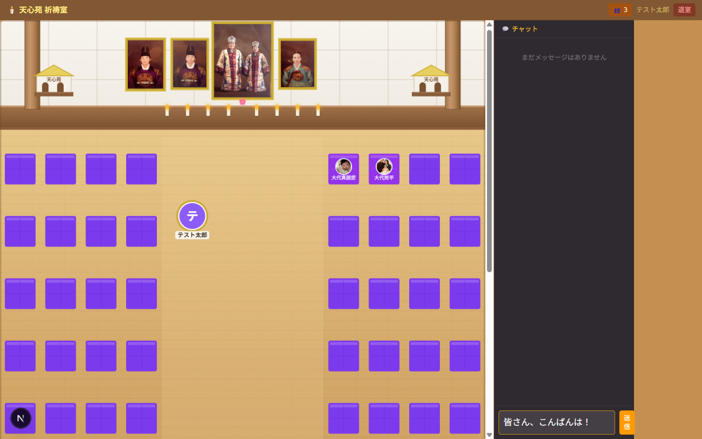
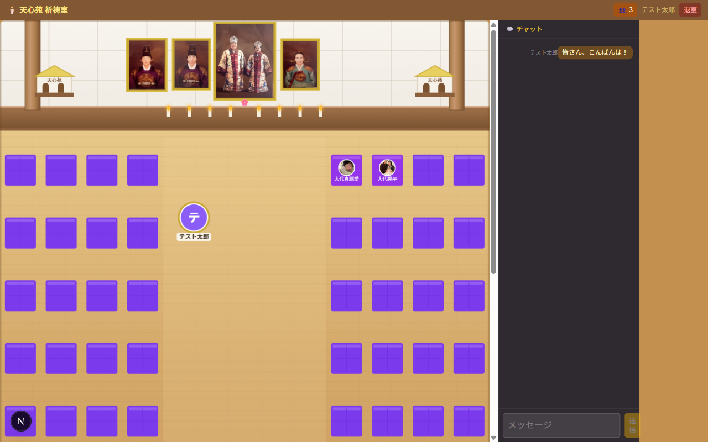
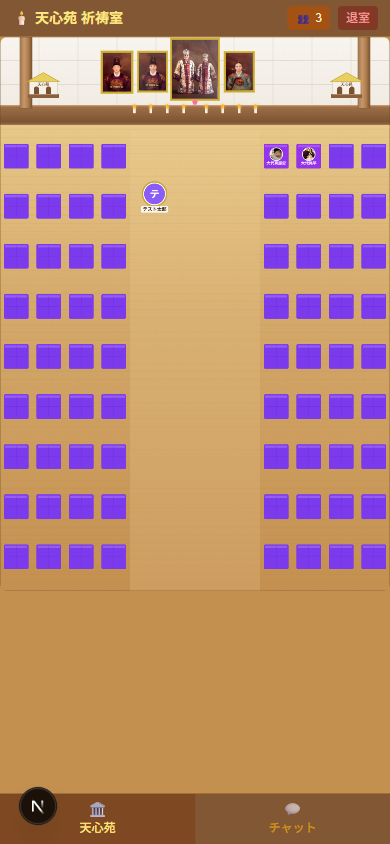

# バーチャル天心苑 祈祷室 — 取扱説明書

> **対象**: 祈祷会に参加するすべての方  
> **最終更新**: 2026-05-26

---

## 目次

1. [はじめに](#1-はじめに)
2. [入室方法](#2-入室方法)
   - [Step 1 — 合言葉の入力](#step-1--合言葉の入力)
   - [Step 2 — プロフィール設定](#step-2--プロフィール設定)
3. [祈祷室の画面説明](#3-祈祷室の画面説明)
4. [主な機能の使い方](#4-主な機能の使い方)
   - [アバターを動かす](#41-アバターを動かす)
   - [座布団に座る・立つ](#42-座布団に座る立つ)
   - [他の参加者に話しかける](#43-他の参加者に話しかける)
   - [チャットを使う](#44-チャットを使う)
   - [参加者一覧を見る](#45-参加者一覧を見る)
5. [スマートフォンでの使い方](#5-スマートフォンでの使い方)
6. [退室方法](#6-退室方法)
7. [よくある質問 / トラブルシューティング](#7-よくある質問--トラブルシューティング)

---

## 1. はじめに

**バーチャル天心苑 祈祷室**は、天心苑祈祷会にオンラインで参加するためのシステムです。  
自分のアバターを動かして他の参加者と「場」を共有しながら、祈祷会にご参加いただけます。

| 項目 | 内容 |
|------|------|
| 開催時間 | 平日 22:00〜25:00（目安） |
| 接続先 | 管理者から共有されたURL |
| 推奨環境 | Chrome / Safari / Edge（最新版） |
| 端末 | PC・スマートフォン・タブレット対応 |

---

## 2. 入室方法

### Step 1 — 合言葉の入力

アクセスすると「天心苑 祈祷室」のログイン画面が表示されます。

1. **合言葉**の入力欄に、事前にお知らせした合言葉を入力します  
2. **「確認」** ボタンをタップ / クリックします

> ⚠️ 合言葉は大文字・小文字を区別します。正確に入力してください。

**2回目以降の入室（保存済みプロフィール）**

以前ご入室されたことがある場合、合言葉画面にお名前と写真のプレビューが表示されます。  
そのまま **「🙏 入室する」** をタップすれば、すぐに祈祷室へ入室できます。

---

### Step 2 — プロフィール設定

合言葉が正しければ、プロフィール設定画面に切り替わります。

#### お名前の入力（必須）

- **「祈祷室に表示されるお名前」** 欄にお名前（または法名）を入力します  
- 最大20文字まで入力できます

#### プロフィール写真の設定（任意）

- カメラアイコンをタップして写真を選択できます  
- スマートフォンの場合：カメラ撮影 / ギャラリーから選択が可能です  
- 写真は自動的に小さく圧縮されます（200×200px）

> 📌 プロフィール情報はブラウザに保存されます。次回入室時は自動的に復元されます。  
> プロフィールを変更したい場合は、合言葉画面の **「変更」** をタップしてリセットできます。

#### 入室ボタン

「**🙏 祈祷室に入室**」ボタンをタップして入室します。

---

## 3. 祈祷室の画面説明

### ヘッダー（画面上部）

| ボタン | 説明 |
|--------|------|
| 🕯️ 天心苑 祈祷室 | タイトル |
| 🪑 離席 | 着席中の時のみ表示。座布団から立つ |
| 👥 人数 | 参加者数。タップで一覧を表示 |
| お名前 | 現在ログイン中の名前（PC のみ表示） |
| 退室 | 祈祷室から退室する |

### 祈祷室エリア（Canvas）

画面中央に天心苑の祈祷室が描画されています。

| 要素 | 説明 |
|------|------|
| 御真影 | 上部に4枚の御真影が掲示されています |
| 座布団 | 左右各36席（合計72席）のグリッド状の座席 |
| アバター | 参加者のアイコン（丸型写真 or イニシャル） |
| 金色リング | 自分自身のアバターに表示される目印 |
| 蝋燭・祭壇 | 背景の装飾（クリック不可） |

### チャットパネル（右側 / Chat タブ）

リアルタイムでメッセージを送受信できます。  
自分のメッセージは右寄り（琥珀色）、他の方のメッセージは左寄り（白）で表示されます。

---

## 4. 主な機能の使い方

### 4.1 アバターを動かす

**PC（マウス操作）**

1. 祈祷室エリア内の**空きスペース**をクリックします  
2. 自分のアバターがその位置へ移動します  
3. 他の参加者の画面にも即時反映されます

**スマートフォン（タッチ操作）**

1. 「🏛️ 天心苑」タブを表示した状態で操作します  
2. 空きスペースを**タップ**すると移動します  
3. **ピンチイン / アウト**で画面を拡大・縮小できます（最大4倍）  
4. 拡大中は**1本指ドラッグ**で画面をスクロールできます  
5. **ダブルタップ**で元のサイズ（ズームリセット）に戻ります

---

### 4.2 座布団に座る・立つ

#### 着席する

1. 祈祷室左右に並ぶ**座布団（クッション）**をタップ / クリックします  
2. 「🪑 着席しますか？」確認ダイアログが表示されます  
3. **「着席する」** をタップすると、その座布団の上にアバターが移動します

> 着席中のアバターは座布団の上に小さく表示されます。

#### 離席する

以下のいずれかの方法で離席できます：

- ヘッダーの **「🪑 離席」** ボタンをタップする
- 自分が座っている座布団を再度タップする

---

### 4.3 他の参加者に話しかける

他の参加者のアバターをタップ / クリックすると「話しかける」ダイアログが開きます。

**手順**

1. 話しかけたい参加者のアバターをタップします  
2. ダイアログで **「📞 話しかける」** をタップします  
3. Google Meet の固定リンクが表示されます  
4. 相手の方にも**通知トースト**でリンクが共有されます  
5. **「🎥 Google Meet に参加」** をタップして通話に参加します

> 📌 Google Meet のリンクは全員共通の固定リンクです。  
> 何人でも同じルームに途中参加できます。

> ⚠️ 着席中の他の参加者の座布団をタップすると「話しかける」ダイアログが開きます。

---

### 4.4 チャットを使う

テキストでリアルタイムにメッセージを送受信できます。

**メッセージの送信方法**

1. チャットパネル下部の入力欄にメッセージを入力します  
2. **「送信」** ボタンをタップ、または **Enter キー**を押します  
3. 送信したメッセージは右側（琥珀色背景）に表示されます

**チャットの仕様**

| 項目 | 仕様 |
|------|------|
| 最大文字数 | 200文字 |
| 保存期間 | 8時間（自動削除） |
| 取得件数 | 最大200件（過去8時間以内） |
| リアルタイム更新 | Supabase Realtime で即時同期 |

**チャット通知（スマートフォン）**

チャットタブを表示していない状態で新しいメッセージが届くと：
- 画面上部に通知トーストが表示されます
- チャットタブのアイコンに**未読バッジ（赤丸・数字）**が付きます

---

### 4.5 参加者一覧を見る

ヘッダーの **「👥 人数」** ボタンをタップすると、現在の参加者一覧が表示されます。

| 表示内容 | 説明 |
|---------|------|
| ●（色丸） | アバターカラー（全員共通：紫） |
| お名前 | 参加者の名前 |
| （自分） | 自分自身に表示 |
| 着席中 | 座布団に座っている場合に表示 |

もう一度ボタンをタップすると閉じます。

---

## 5. スマートフォンでの使い方

スマートフォンでは画面下部に**タブバー**が表示されます。

| タブ | 表示内容 |
|------|---------|
| 🏛️ 天心苑 | 祈祷室 Canvas（アバター・座布団） |
| 💬 チャット | チャットパネル |

**スマートフォン特有の操作**

| 操作 | 動作 |
|------|------|
| タップ | アバター移動 / 座布団着席 / 話しかける |
| ピンチイン/アウト | ズームイン / アウト（1〜4倍） |
| 1本指ドラッグ（拡大中） | 画面のスクロール |
| ダブルタップ | ズームをリセット |

> 📌 テキスト入力時の自動ズームを防ぐため、入力欄は16px以上のフォントサイズに設定されています。

---

## 6. 退室方法

1. ヘッダー右上の **「退室」** ボタンをタップします  
2. 確認ダイアログで **「OK」** をタップします  
3. ログイン画面に戻ります

> ⚠️ ブラウザを閉じても退室処理は自動的に行われます（ハートビートが途絶えた場合）。  
> ただし、他の参加者への「〇〇さんが退室しました」通知は出ない場合があります。  
> できるだけ「退室」ボタンから退室されることをお勧めします。

---

## 7. よくある質問 / トラブルシューティング

### Q. 「合言葉が正しくありません」と表示される

合言葉は毎回変わります。最新の合言葉を主催者にお問い合わせください。

---

### Q. アバターが表示されない / 動かない

以下をお試しください：

1. **ページを再読み込み**（F5 / ブラウザの更新ボタン）
2. **一度ログアウトして再入室**（「退室」ボタン → 再度ログイン）
3. **別のブラウザを試す**（Chrome を推奨）

---

### Q. 他の参加者が見えない

インターネット接続を確認し、ページを再読み込みしてください。  
接続が不安定な場合、Supabase Realtime の同期が遅れることがあります。

---

### Q. 「話しかける」ボタンを押してもエラーになる

Google Meet の固定リンクが設定されていない可能性があります。  
管理者（Vercel ダッシュボード）にて `FIXED_MEET_LINK` 環境変数が設定されているか確認してください。

---

### Q. プロフィール写真が表示されない

写真の読み込みに少し時間がかかることがあります。  
しばらく待っても表示されない場合は、再読み込みをお試しください。

---

### Q. チャットの過去メッセージが消えた

チャットメッセージは **8時間後に自動削除**されます。  
祈祷会開始前のメッセージは翌日以降には表示されません。

---

### Q. スマートフォンで画面が見づらい

- **ピンチアウト**（指を広げる）で画面を拡大してご覧ください
- **ダブルタップ**で元のサイズに戻ります
- 横画面（ランドスケープ）でのご利用も可能です

---

## 管理者向け情報

| 項目 | 設定場所 |
|------|---------|
| 合言葉の変更 | Vercel ダッシュボード → Environment Variables → `ACCESS_PASSPHRASE` |
| Google Meet リンクの設定 | Vercel ダッシュボード → Environment Variables → `FIXED_MEET_LINK` |
| データベース管理 | Supabase ダッシュボード |
| Realtime の有効化 | Supabase → Database → Replication → `sessions` / `messages` / `call_requests` を有効化 |

---

*天心苑 祈祷会 — バーチャル祈祷室 取扱説明書*
